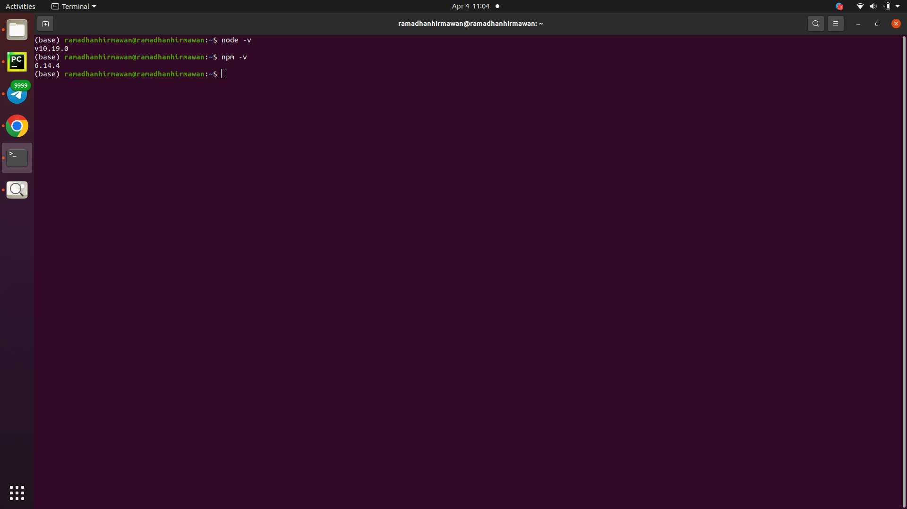

1. Node.js:

Node.js adalah lingkungan runtime sisi server yang memungkinkan pengguna menjalankan kode JavaScript di sisi server

Cara Menginstal node dan npm Ubuntu:

```sh
brew install node
```
Kelebihan:

- `bahasa mudah dipahami dan banyak dipakai di web developer yang saya tau.`

Kekurangan:

- `Waktu pengembangan yang dibutuhkan lebih banyak karena developer menulis semuanya dari nol.`

2. NPM:

Node Package Manager atau NPM adalah package manager dan repositori software dalam bahasa pemrograman JavaScript yang digunakan untuk memasang, menghapus, dan mengelola library atau package software dalam proyek pengembangan aplikasi.

`Check NPM dan Node.js`


3. NVM:

NVM (Node Version Manager) adalah sebuah tool yang dapat memudahkan developer dalam instalasi dan mengatur banyak versi Node.js sekaligus di atas satu environment

```sh
sudo apt install curl
curl https://raw.githubusercontent.com/creationix/nvm/master/install.sh | bash 
```
