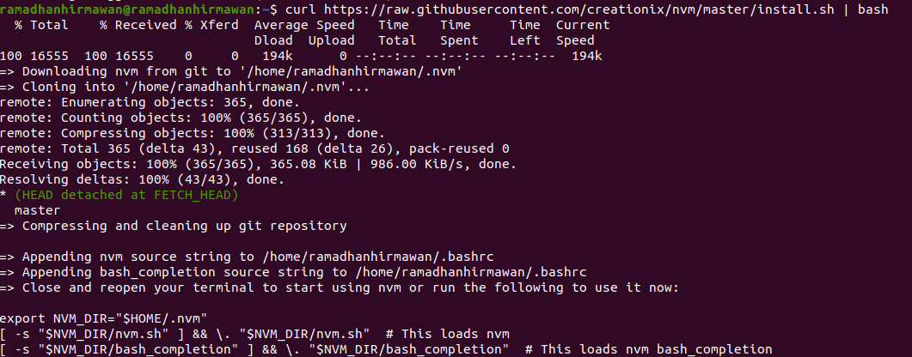

###Bash Script Auto Installer
- Nginx
- Nodejs
- NPM
- NVM

1. htop:

htop adalah alat baris perintah yang membantu memantau sumber daya dan kinerja sistem pada Linux.
Lebih baik daripada top dan sering tersedia secara default.

Fitur Utama:

- Tampilan Interaktif: htop memungkinkan untuk memfilter dan mengurutkan proses agar lebih mudah dipahami.
- Tampilan Pohon: Melihat proses dalam bentuk pohon.
- Menghentikan Proses: Menghentikan proses yang bermasalah.

Kelebihan:

- `Tampilan yang Lebih Menarik: htop menampilkan informasi dengan kode warna sehingga lebih terorganisir.
Interaksi dengan Mouse: dapat menggunakan mouse untuk berinteraksi dengan htop.`

Kekurangan:

- `Tidak Ada Output yang Cantik: Jika menginginkan tampilan yang lebih cantik, ada alternatif lain.`

Cara Menginstal htop (Ubuntu/Debian):

```sh
sudo apt install htop
```

2. nmon:

nmon adalah alat yang memberikan informasi rinci tentang proses yang berjalan di sistem.
Cocok untuk administrator sistem yang memerlukan data historis untuk analisis jangka panjang.

Kelebihan:

- `Informasi Lengkap: nmon memberikan semua data yang butuhkan untuk memahami proses di sistem.
Pemantauan Historis: Membuat log penggunaan sumber daya untuk analisis jangka panjang.`

Kekurangan:

- `Tampilan Kurang Menarik: Tidak memberikan tampilan yang cantik.`

Cara Menginstal nmon (Ubuntu/Debian):

```sh
sudo apt install nmon
```

Keduanya memiliki kegunaan yang berbeda, tergantung pada kebutuhan.

3. Node.js:

Node.js adalah lingkungan runtime sisi server yang memungkinkan pengguna menjalankan kode JavaScript di sisi server

Cara Menginstal nmon (Ubuntu/Debian):

```sh
brew install node
```
Kelebihan:

- `bahasa mudah dipahami dan banyak dipakai di web developer yang saya tau.`

Kekurangan:

- `Waktu pengembangan yang dibutuhkan lebih banyak karena developer menulis semuanya dari nol.`


