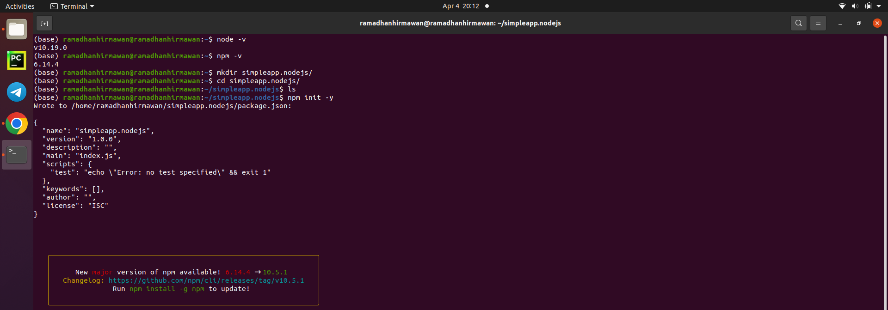
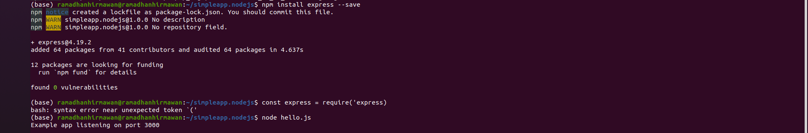
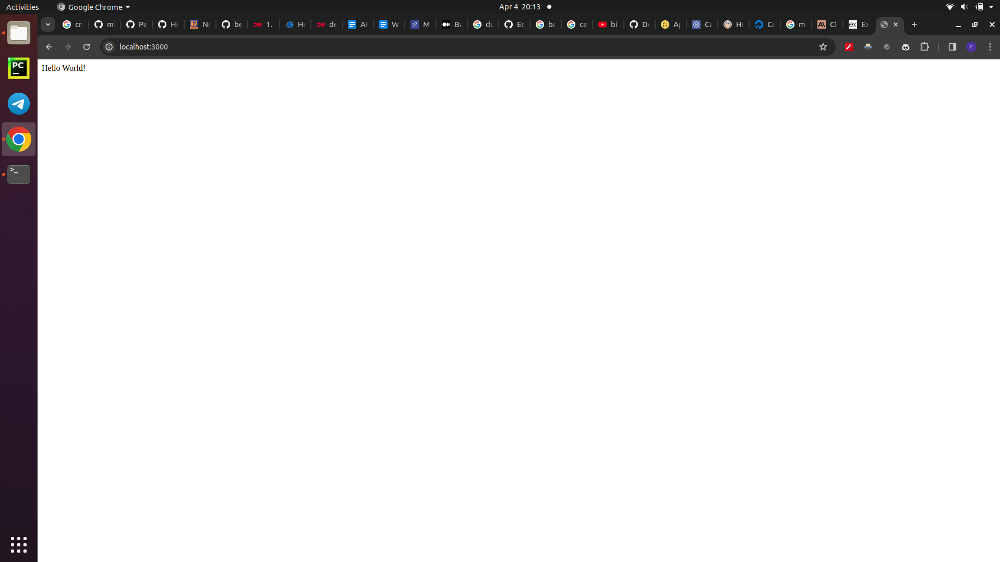
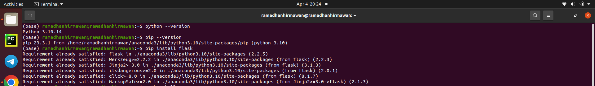
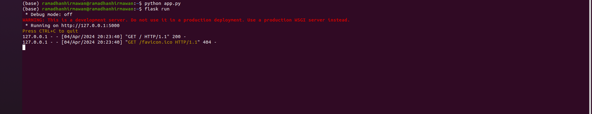
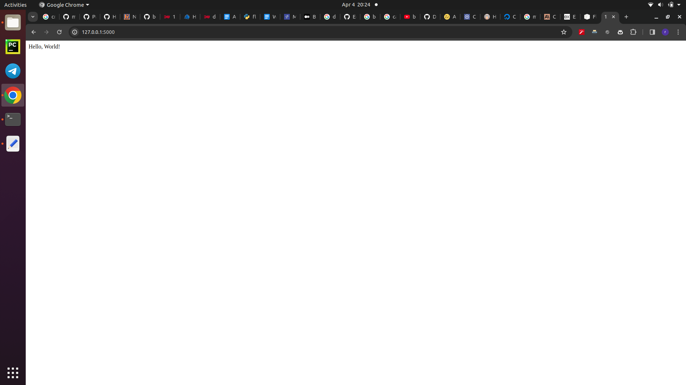
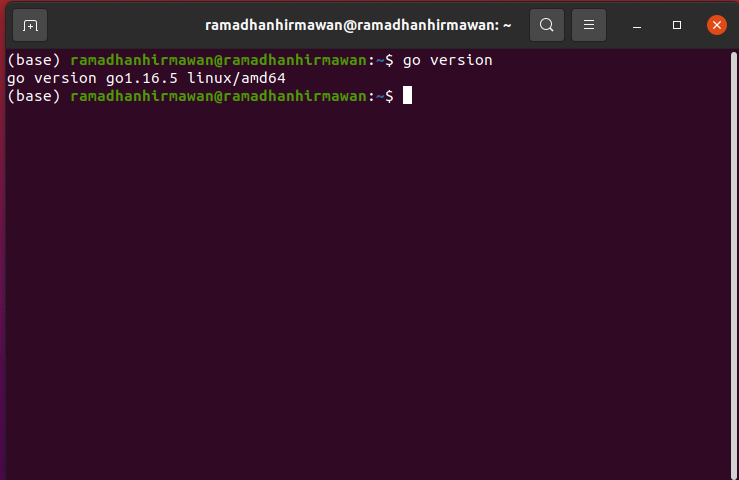

# Penjelasan Monolith dan Microservices

Monolith: Aplikasi monolith adalah aplikasi yang dibangun sebagai satu unit besar yang terdiri dari seluruh komponen dan fitur yang dibutuhkan. Semua komponen, seperti antarmuka pengguna (UI), layanan, basis data, dan logika bisnis, dikemas dan dijalankan dalam satu proses tunggal

Microservices: Microservices adalah pendekatan arsitektur di mana aplikasi dibagi menjadi beberapa layanan kecil yang terpisah, mandiri, dan dapat dijalankan secara independen. Setiap mikroservice bertanggung jawab atas tugas atau fungsi spesifik dan dapat dikembangkan, diperbarui, dan diskalakan secara terpisah.

## Perbedaan Monolith dan Microservices

1. Skalabilitas: Dalam arsitektur monolith, jika satu bagian aplikasi membutuhkan lebih banyak sumber daya, seluruh aplikasi harus diskalakan. Sebaliknya, dalam arsitektur microservices, setiap layanan dapat diskalakan secara independen sesuai dengan kebutuhan, sehingga lebih efisien dan fleksibel.
2. Teknologi: Dalam arsitektur monolith, seluruh aplikasi umumnya menggunakan teknologi yang sama. Sedangkan dalam arsitektur microservices, setiap layanan dapat menggunakan teknologi yang berbeda-beda sesuai dengan kebutuhan spesifik layanan tersebut
3. Pengembangan dan Penyebaran: Dalam arsitektur monolith, perubahan atau pembaruan pada satu bagian aplikasi memerlukan pembaruan dan penyebaran ulang seluruh aplikasi. Sementara dalam arsitektur microservices, setiap layanan dapat dikembangkan, diperbarui, dan disebar secara terpisah tanpa mengganggu layanan lain.
4. Ketahanan (Resilience): Dalam arsitektur monolith, jika satu komponen gagal, seluruh aplikasi akan terganggu. Namun, dalam arsitektur microservices, jika satu layanan gagal, layanan lain dapat tetap berjalan, sehingga meminimalkan gangguan pada seluruh aplikasi.
5. Kompleksitas: Arsitektur monolith umumnya lebih sederhana dalam hal pengembangan dan penyebaran, tetapi dapat menjadi lebih kompleks saat aplikasi tumbuh besar. Sedangkan arsitektur microservices dapat menjadi lebih kompleks dalam hal manajemen dan komunikasi antar layanan, tetapi lebih mudah dalam hal skalabilitas dan pemeliharaan.

## Contoh Aplikasi dalam Monolith dan Microservices

monolith: contoh matahari.com Dalam arsitektur monolith, seluruh fitur aplikasi, seperti katalog produk, keranjang belanja, metode pembayaran, pengiriman, dan manajemen akun, dikemas dalam satu aplikasi besar.

Microservices: contoh gojek. 

Layanan Rekomendasi: Menyediakan rekomendasi setiap bagannya misal gofood rekomendasi makanan bisa dari jaraknya atau murahnya/gojek rekomendasi pakai voucher atau tidak.
Layanan Pembayaran: Menangani pembayaran cash/gopay/pakai kartu debit digital.
Layanan Akun Pengguna: Mengelola informasi akun pengguna dan lain-lain

Setiap layanan ini dibangun, dijalankan, dan diskalakan secara terpisah, tetapi bekerja sama untuk menyediakan fungsionalitas lengkap aplikasi gojek.

### Cara Untuk Mendeploy Node.js

### Cara Untuk Mendeploy Python

### Cara Untuk Mendeploy Golang
1. Download go : 	
wget htExtract dan copy data
2. rm -rf /usr/local/go && tar -C /usr/local -xzf go1.16.5.linux-amd64.tar.gz && exit tps://golang.org/dl/go1.16.5.linux-amd64.tar.gz && sudo su
3. Masukkan path go pada bashrc
export PATH=$PATH:/usr/local/go/bin
4. Sesuai Gambar di bawah

