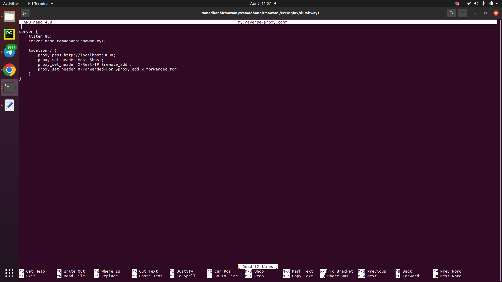
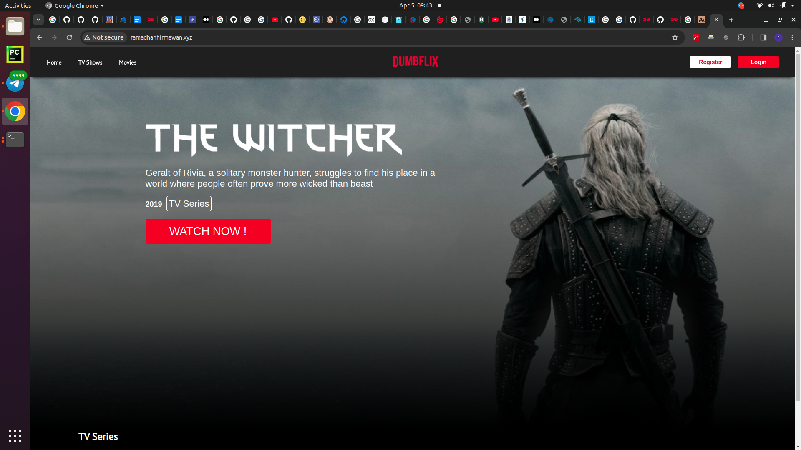

# Web Server dan load balancing

## Web Server 

sebuah software yang memberikan layanan berupa data. Berfungsi untuk menerima permintaan HTTP atau HTTPS dari client atau di kenal dengan web browser (chrome atau firefox). Kemudian web server akan mengirimkan respon atas permintaan tersebut dalam bentuk halaman web.

saya bikin proxy seperti ini

```sh
server {
    listen 80;
    server_name ramadhanhirmawan.xyz;

    location / {
        proxy_pass http://localhost:3000;
        proxy_set_header Host $host;
        proxy_set_header X-Real-IP $remote_addr;
        proxy_set_header X-Forwarded-For $proxy_add_x_forwarded_for;
    }
}
```

1. cd dumbways
2. sudo nano my.reverse-proxy.conf masukan konfigurasi diatas
3. cd ..
4. sudo nano nginx.conf tambahkan di ###virual hosts config tambahkan include /etc/nginx/dumbways/*
5. sudo nginx -t
6. sudo systemctl restart nginx
7. sudo nano /etc/hosts masukkan ip
8. git clone https://github.com/dumbwaysdev/dumbflix-frontend.git
9. lalu buka terminal baru
10. cd dumbflix-frontend
11. npm install
12. npm start

edit my.reverse-proxy.conf


masuk ke front-end


## Load Balancing 
suatu jaringan komputer yang menggunakan metode untuk mendistribusikan beban kerjaan pada dua atau bahkan lebih suatu koneksi jaringan secara seimbang agar pekerjaan dapat berjalan optimal dan tidak overload (kelebihan) beban pada salah satu jalur koneksi.
